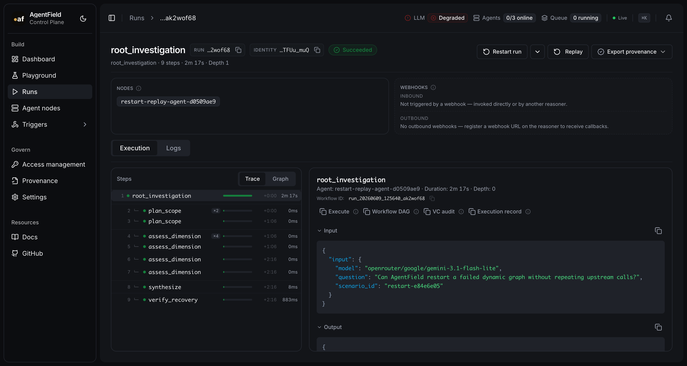
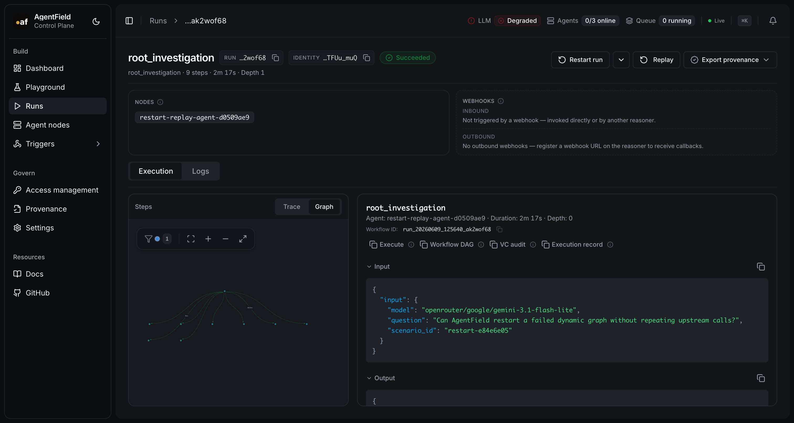
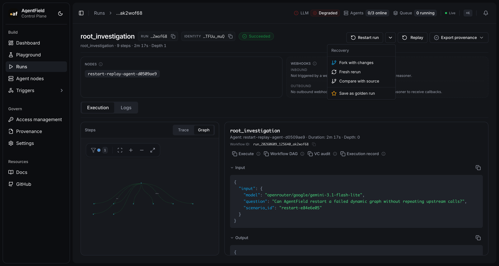

# Workflow Restart, Fork, And Replay DX

> **Status**: V1/V1.5 implemented in this workspace  
> **Author**: Product architecture brainstorm  
> **Scope**: Control plane REST, CLI, SDK helper clients, workflow DAG UI, execution detail UI  
> **Date**: 2026-06-09

---

## Implementation Status

Implemented:

- REST restart endpoint: `POST /api/v1/executions/{execution_id}/restart`.
- UI mirror endpoint: `POST /api/ui/v1/executions/{execution_id}/restart`.
- Public request field: `reuse`.
- CLI: `af execution restart` with `--scope`, `--reuse`, `--fork`, `--model`, `--input`, `--reason`, `--json`.
- Python and TypeScript SDK helpers.
- Runtime replay header propagation for Python and TypeScript nested calls.
- Control-plane replay at successful child-call boundaries.
- Restart actions in run rows, run detail, and execution detail.
- DAG node actions through the existing node detail sidebar: restart from here, rerun node only, fork with changes.
- Fork-with-changes dialog on run detail.
- Source/fork compare link using the existing compare page.
- Reused DAG node badge and source execution metadata.
- Golden-run save action, metadata, run-list badge, and run-list filter.

Validation:

- Go handler/server/CLI tests cover replay hits, no-hit fallback, and root restart replay header propagation.
- Frontend build and row/run-list tests pass.
- TypeScript SDK lint/build and Python SDK compile pass.
- Live OpenRouter E2E passes against the current control plane on an isolated local port using `openrouter/google/gemini-3.1-flash-lite`: a complex graph failed at `synthesize`, restarted from that failed execution, reused upstream `plan_scope` and parallel `assess_dimension` calls, then completed `verify_recovery`.

Screenshots:

- Run detail with one-click restart and replay evidence: 
- DAG graph showing the restarted run: 
- Advanced restart actions menu: 

## 1. Summary

AgentField should treat every successful `app.call(...)` boundary as an implicit workflow checkpoint. When a workflow fails, or when a developer wants to branch from a past run, the control plane can start a new run, reuse previous successful child-call outputs, and execute only the parts that need fresh work.

The product sentence:

> Restart a run from any point and reuse the successful agent calls already recorded by AgentField.

This is a control-plane and runtime feature. User reasoner code should not contain replay logic. Existing `app.call(...)` remains the only cross-reasoner primitive.

---

## 2. Design Critique And Corrections

The first-pass design had the right architecture, but the DX needed tightening after reviewing the current UI:

- It introduced too many parallel words: restart, fork, rerun, replay, checkpoint, golden, fixture. The UI should expose **Restart** as the primary recovery action and use **Fork** only when the user intentionally changes something.
- It proposed too many visible actions in row menus. Current run rows use a compact kebab menu via `RunLifecycleMenu`; restart belongs there, not as another always-visible row button.
- It used `replay_policy` in examples, but current frontend service code already sends `reuse`. Public request bodies should use `reuse`; lower-level execution metadata can still expose `replay_mode`.
- It included `branch` scope too early. Dynamic DAGs make downstream branch ownership tricky. V1 should support `workflow` and `execution`; branch rerun can wait until DAG slicing is reliable.
- It implied a fork dialog with model and JSON input fields as a normal path. That is too much for the default UX. The default should restart immediately; advanced options should be progressive disclosure.
- It placed golden workflows near V1. Golden runs are powerful, but they should be a thin saved-run layer after restart/fork is proven, not a new product area on day one.
- It underweighted the current execution header. `CompactExecutionHeader` already has pause, resume, stop, refresh, restart, notifications, and navigation. Restart/fork should reuse that exact density and icon-button style.

The improved design is:

1. **Restart** is the default, one-click path.
2. **Fork with changes** is the advanced path.
3. **Reuse previous work** is the default replay policy.
4. **Fresh run** is the escape hatch.
5. **Golden runs** are saved traces, not a separate workflow fixture system.

---

## 3. Product Philosophy

AgentField's advantage is that dynamic agent graphs are observable because every cross-reasoner call goes through the control plane. Restart and fork should deepen that advantage without turning AgentField into a workflow-language product.

The right abstraction is closer to a debugger plus Git branch than a job scheduler:

- A workflow run is a trace.
- A successful `app.call` is a checkpoint.
- A restart is a new attempt with lineage.
- A fork is a restart with intentional changes.
- A replayed node is a cached boundary result, not a resumed stack frame.

The DX should stay small:

- No new decorators.
- No reasoner-level replay APIs.
- No mandatory checkpoint calls.
- No workflow DSL.
- No claim that Python or TypeScript resumes mid-function.

---

## 4. Target Capabilities

This design covers the seven requested capabilities:

1. Workflow forking.
2. Cheap failure recovery.
3. Branch and compare.
4. Agent debugger.
7. Prompt regression testing.
10. Workflow checkpoints.
15. Golden workflow library.

The product should not expose all seven as equally prominent UI areas. They are use cases powered by one primitive: start a new run from a prior execution with optional reuse.

---

## 5. Core Semantics

### 5.1 Restart

Restart creates a new run from an existing execution.

Default behavior:

- Find the source execution.
- Find the source run and root execution.
- Start the root target again unless `scope` is `execution`.
- Create a new run ID.
- Reuse successful matching child calls before the selected point.
- Execute the selected failed point and downstream work fresh.
- Link the new run to the source run and source execution.

### 5.2 Fork

Fork is restart with an intentional change.

Fork examples:

- Change model.
- Change input.
- Change prompt version through context.
- Change agent version once routing supports explicit version pinning.
- Change reuse mode.

In UI, fork should appear as **Fork with changes**, not as the default action.

### 5.3 Reuse

Use **reuse** as the public term in REST, CLI, and UI. It is clearer than "replay" for users.

Reuse means the control plane returns a previous successful result for a matching child call. Internally, this can still be implemented as replay.

Minimum match key:

- source run ID
- target node ID
- reasoner or skill ID
- canonical input payload
- successful previous status
- reuse mode allowing that source execution

### 5.4 Checkpoint

Every successful `app.call(...)` is an implicit checkpoint.

Do not add:

```python
await app.checkpoint("step_3")
```

That leaks the wrong abstraction. AgentField already owns the boundary.

---

## 6. REST API

### 6.1 Endpoint

```http
POST /api/v1/executions/{execution_id}/restart
Content-Type: application/json
```

Default body:

```json
{}
```

Default response:

```json
{
  "execution_id": "exec_new_root",
  "run_id": "run_new",
  "workflow_id": "run_new",
  "status": "queued",
  "target": "research.synthesize",
  "type": "reasoner",
  "source_execution_id": "exec_failed",
  "source_run_id": "run_original",
  "restarted_execution_id": "exec_source_root",
  "replay_before_execution_id": "exec_failed",
  "replay_mode": "succeeded-before",
  "scope": "workflow",
  "webhook_registered": false
}
```

### 6.2 Request Body

Use the current frontend request language:

```json
{
  "scope": "workflow",
  "reuse": "succeeded-before",
  "reason": "Retry after prompt fix",
  "input": null,
  "context": {
    "model": "openrouter/google/gemini-3.1-flash-lite"
  }
}
```

### 6.3 Field Semantics

`scope`

- `workflow`: restart the source run from its root. Default.
- `execution`: rerun only the selected execution target. Useful for debugger mode.

Do not ship `branch` in V1. It sounds attractive, but dynamic graphs make "downstream branch" ambiguous unless the control plane can prove branch ownership.

`reuse`

- `succeeded-before`: reuse successful matching calls that happened before the selected execution. Default.
- `all-succeeded`: reuse any successful matching call from the source run.
- `none`: fresh run with lineage only.

`input`

- omitted or `null`: use original input.
- object: override input for the restarted root or selected execution.

`context`

- optional override for model, prompt version, eval label, or metadata.

### 6.4 Internal Replay Headers

Runtime SDKs should submit nested calls normally. They only propagate restart context:

```http
X-AgentField-Replay-Source-Run-ID: run_original
X-AgentField-Replay-Before-Execution-ID: exec_failed
X-AgentField-Replay-Mode: succeeded-before
```

The execution gateway decides whether to dispatch or reuse a previous result.

---

## 7. CLI DX

The CLI should be boring and predictable.

### 7.1 Restart

```bash
af execution restart exec_failed
```

Output:

```text
Restarted run run_original from exec_failed
New run: run_new
Reuse: succeeded-before
Open: http://localhost:8080/ui/runs/run_new
```

### 7.2 Fork With Changes

Prefer a `--fork` flag over a separate command at first:

```bash
af execution restart exec_failed \
  --fork \
  --model openrouter/google/gemini-3.1-flash-lite
```

If usage proves strong, add `af execution fork` as an alias later.

### 7.3 Fresh Rerun

```bash
af execution restart exec_failed --reuse none
```

### 7.4 Execution-Only Debug Rerun

```bash
af execution restart exec_failed --scope execution
```

### 7.5 Flags

Keep the V1 flags to:

- `--scope workflow|execution`
- `--reuse succeeded-before|all-succeeded|none`
- `--fork`
- `--model <id>`
- `--input @payload.json`
- `--reason <text>`
- `--json`

Do not expose low-level replay headers in CLI.

---

## 8. SDK DX

SDK support should be thin control-plane client convenience.

Python:

```python
client.restart_execution("exec_failed")
client.restart_execution(
    "exec_failed",
    fork=True,
    context={"model": "openrouter/google/gemini-3.1-flash-lite"},
)
```

TypeScript:

```typescript
await client.restartExecution("exec_failed");
await client.restartExecution("exec_failed", {
  fork: true,
  context: { model: "openrouter/google/gemini-3.1-flash-lite" },
});
```

Runtime SDKs should only:

- preserve replay headers from inbound execution context
- forward replay headers on nested `app.call(...)`
- keep existing `app.call` return shape unchanged

No reasoner should need:

```python
if app.is_replay:
    ...
```

That would make replay part of business logic and break the product promise.

---

## 9. UI/UX Design

### 9.1 Current UI Pattern To Reuse

The existing app already points to the right shape:

- `RunLifecycleMenu` uses a compact row kebab menu for pause, resume, cancel, and restart.
- `CompactExecutionHeader` uses dense icon buttons with tooltips for pause, resume, stop, restart, and refresh.
- Existing mutation feedback uses success/error notifications.
- Cancel uses an `AlertDialog` because it is destructive.
- Restart is non-destructive because it creates a new run. It should not require a confirmation for the default path.

The restart UI should reuse these patterns. Do not create a new replay page.

### 9.2 Run Rows

Run rows should keep restart inside the kebab menu.

Label:

```text
Restart run
```

Show when:

- run is terminal
- root execution ID exists
- user has permission to execute the source target

Menu grouping:

- Lifecycle: pause, resume
- Recovery: restart run
- Destructive: cancel run

The current `RunLifecycleMenu` places restart after cancel. That works mechanically, but product-wise restart should sit before destructive actions or below a separator labeled recovery.

### 9.3 Run Detail Header

Run detail is where the primary visible restart action belongs.

Recommended controls:

- Primary icon button: `Restart run`
- Overflow menu:
  - Restart run
  - Fork with changes
  - Fresh rerun
  - Save as golden run

Use `RotateCcw` for restart if available; use `GitBranch` for fork. If only one icon is exposed, use `GitBranch` only when the action is explicitly a fork.

### 9.4 Execution Detail Header

For `CompactExecutionHeader`, the current direction is good: a compact icon action with tooltip.

Copy should be precise:

- Tooltip: `Restart workflow from this point`
- Mobile menu: `Restart from here`
- Success notification: `New run started from this point`

Do not say "running again" because the original execution is not resumed.

### 9.5 DAG Node Context Menu

The DAG is the debugger surface.

On each node:

- Restart workflow from here
- Rerun this node only
- Fork with changes
- Copy input
- Copy output

The first action should be enabled for failed and terminal nodes. For running nodes, prefer pause/cancel semantics.

### 9.6 Replayed Node Visuals

Reused nodes need lightweight visual proof.

Use:

- small `reused` badge
- muted outline
- link to source execution

Avoid:

- large cards inside DAG nodes
- verbose explanatory text
- a new color family that competes with status colors

Recommended labels:

- `fresh`
- `reused`
- `changed`
- `failed`

Use `reused` in UI rather than `replayed`; it matches the public request field.

### 9.7 Fork With Changes Dialog

This should be progressive disclosure, not a form-heavy default.

Dialog title:

```text
Fork with changes
```

Default visible controls:

- Reuse mode segmented control:
  - Reuse previous work
  - Fresh run
- Model override input
- Reason input

Collapsed advanced controls:

- Input JSON override
- Context JSON override

Primary action:

```text
Start fork
```

Secondary:

```text
Cancel
```

Restart should not open this dialog. Only fork should.

### 9.8 Branch And Compare

Do not build a full compare page in V1.

Add a source-run chip on forked run detail:

```text
Forked from run_original
```

Add a compact compare drawer later:

- status
- duration
- fresh calls
- reused calls
- changed nodes
- final output diff

This keeps compare useful without turning it into analytics.

### 9.9 Prompt Regression Testing

Prompt regression should use fork and golden runs, not a separate UI.

Flow:

1. Save a good run as golden.
2. Fork it with a new model or prompt context.
3. Compare changed nodes and final output.

The UI should call this:

```text
Run against changes
```

Avoid "A/B test" language. This is developer regression work, not product experimentation.

### 9.10 Golden Workflow Library

Golden workflows should be a saved-run layer, not a new workflow product.

V1.5 shape:

- `Save as golden run` action on successful run detail.
- `Golden` badge on saved runs.
- filter in runs list.
- fork from golden run.

Metadata:

```json
{
  "golden": {
    "name": "Deep research happy path",
    "tags": ["eval", "demo", "regression"],
    "saved_by": "user",
    "saved_at": "2026-06-09T00:00:00Z"
  }
}
```

Do not add a separate golden-run management page until there are enough saved runs to justify it.

---

## 10. Capability-Specific Decisions

### 10.1 Workflow Forking

Best DX:

- Default restart stays one click.
- Fork appears only when the user changes model, input, context, or reuse mode.
- Forked runs show source lineage in the run header.

REST:

```json
{
  "scope": "workflow",
  "reuse": "succeeded-before",
  "context": {
    "model": "openrouter/google/gemini-3.1-flash-lite"
  },
  "reason": "Compare new model"
}
```

### 10.2 Cheap Failure Recovery

Best DX:

- Failed run shows `Restart run`.
- No dialog for default restart.
- Toast links to the new run.

Copy:

```text
New run started. Prior successful calls will be reused when inputs match.
```

Future enhancement:

```text
7 calls can be reused. 3 calls will run fresh.
```

Only show this estimate when the backend can compute it cheaply and accurately.

### 10.3 Branch And Compare

Best DX:

- Use fork lineage first.
- Add compare drawer second.
- Avoid dashboards.

The compare unit is a pair of runs, not an experiment.

### 10.4 Agent Debugger

Best DX:

- DAG node context menu is primary.
- Execution header mirrors it.
- `scope=execution` powers "Rerun this node only."

Good mental model:

```text
This node is the frame. Restart from here.
```

### 10.5 Prompt Regression Testing

Best DX:

- Golden run plus fork.
- Model/context override.
- Changed-node highlighting.

CLI:

```bash
af execution restart exec_source \
  --fork \
  --model openrouter/google/gemini-3.1-flash-lite \
  --reason "prompt regression"
```

### 10.6 Workflow Checkpoints

Best DX:

- No checkpoint API.
- Every successful child call is checkpointable.
- Reused execution detail links back to source execution.

Copy:

```text
Reused from exec_abc123
```

Avoid "snapshot" unless full app state is stored.

### 10.7 Golden Workflow Library

Best DX:

- Save from successful run detail.
- Badge and filter in runs list.
- Fork from golden run.

Do not build a full library surface in V1.

---

## 11. Data Model

Run lineage metadata:

```json
{
  "lineage": {
    "kind": "restart",
    "source_run_id": "run_original",
    "source_execution_id": "exec_failed",
    "reuse": "succeeded-before"
  }
}
```

Execution reuse metadata:

```json
{
  "reuse": {
    "hit": true,
    "source_execution_id": "exec_old_child",
    "source_run_id": "run_original",
    "match": {
      "target": "research.extract_claims",
      "input_hash": "sha256:..."
    }
  }
}
```

Golden run metadata can start on run metadata. If filtering and permissions become important, graduate to a dedicated table.

---

## 12. Guardrails

### 12.1 Never Claim Mid-Function Resume

Correct:

```text
AgentField restarts the workflow and reuses prior successful call outputs.
```

Incorrect:

```text
AgentField resumes Python/TypeScript execution exactly where it crashed.
```

### 12.2 Only Reuse Successful Calls By Default

Failed, cancelled, timed-out, and waiting calls should not be reused as success.

### 12.3 Stable Match Required

Do not reuse based on reasoner name alone.

Minimum key:

- target node
- reasoner or skill ID
- canonical input
- source run
- success status

Add version metadata when available.

### 12.4 Permission And Retention

Reuse reads stored outputs. Permission checks and retention policies still apply.

If a user cannot view the source execution, they should not be able to fork from it.

### 12.5 Reuse Must Be Visible

Silent reuse is bad developer UX.

Every reused node should be visible in:

- execution detail
- workflow DAG
- logs/events
- REST response metadata

---

## 13. What Not To Build In V1

Do not build:

- a separate replay dashboard
- a workflow DSL
- user-authored checkpoint APIs
- a visual workflow editor
- statistical experiment analytics
- arbitrary branch recomposition
- mid-function VM state restore
- a full golden-run library page

Build the narrow loop:

1. failed run
2. restart or fork
3. reuse known-good calls
4. inspect DAG
5. compare source and fork when needed

---

## 14. Recommended V1

V1 should ship:

- REST: `POST /api/v1/executions/:execution_id/restart`
- Request field: `reuse`, not `replay_policy`
- CLI: `af execution restart`, with `--fork` as the advanced branch path
- SDK: thin `restartExecution` helpers
- Runtime SDK: replay header propagation
- UI: restart in run row menu, run detail header, execution header, and DAG node menu
- DAG: reused node badge and source execution link

V1.5 should add:

- fork-with-changes dialog
- source/fork compare drawer
- save as golden run
- golden filter on runs list

This stays powerful while preserving a one-sentence mental model:

> Restart from here, reusing the work AgentField already recorded.
