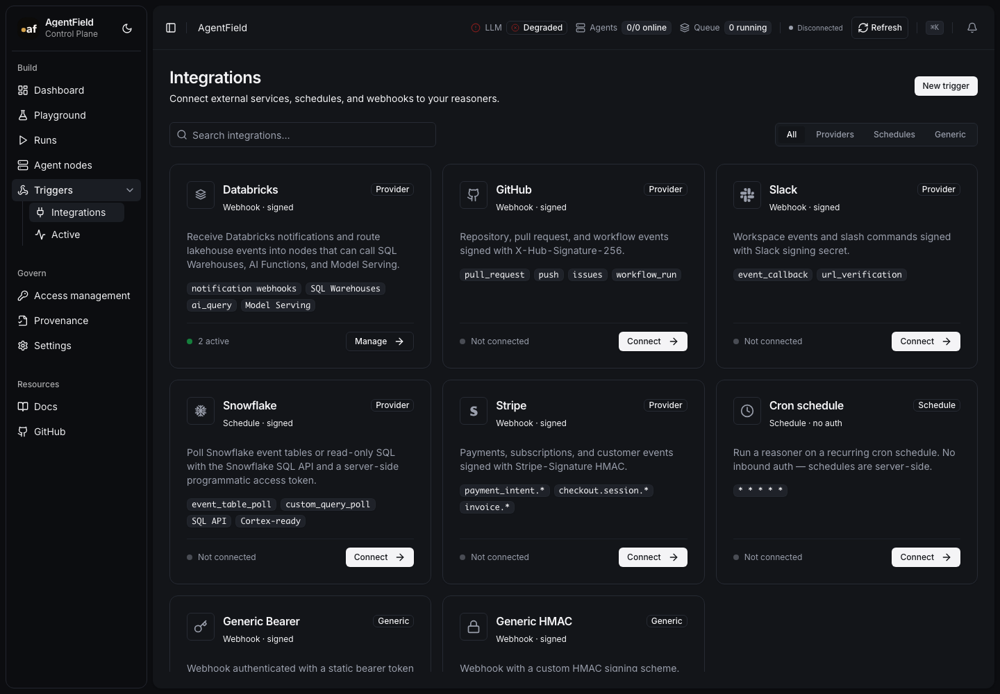
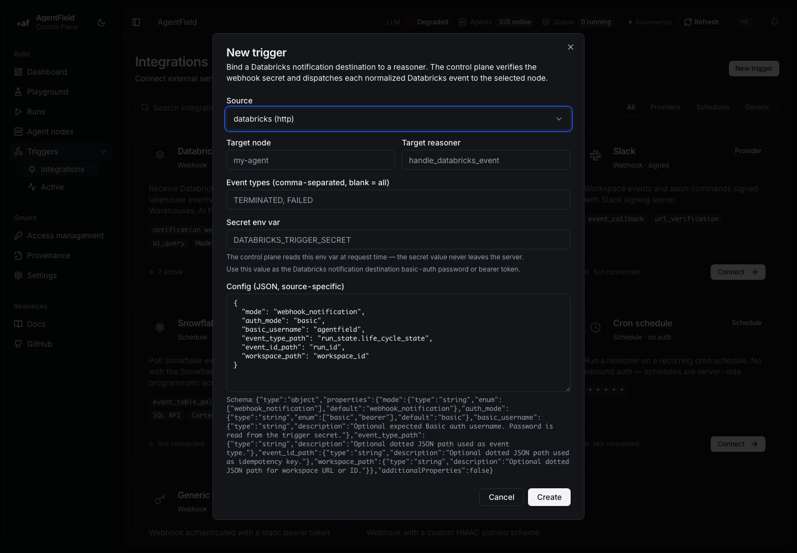

# Databricks Integration Design

Databricks integration is split into a built-in control-plane source and an
optional deployable capability node.

## Control-Plane Source

The source ingests Databricks notification-destination webhooks and dispatches
normalized events to any AgentField reasoner. It supports basic auth or bearer
auth using a trigger secret env var, so the secret value stays in the control
plane environment.

This keeps setup UI/API-first. Operators create the Databricks notification
destination in Databricks, point it at the AgentField trigger URL, and choose
which node reasoner should receive the event.

## Capability Node

The Databricks node is deployed as a standalone AgentField node, for example
`databricks-prod`. It registers typed capabilities that every SDK can call:

```text
databricks-prod.query_readonly
databricks-prod.describe_table
databricks-prod.search_columns
databricks-prod.ai_query
databricks-prod.invoke_serving_endpoint
databricks-prod.explain_result
databricks-prod.handle_databricks_event
```

The node does not wrap Databricks with custom AgentField AI behavior.
Databricks-native AI stays Databricks-native:

- `ai_query` runs through Databricks SQL Warehouses.
- `invoke_serving_endpoint` calls Databricks Model Serving.

## Prompt Overrides

Prompt-backed helpers load templates from configuration:

1. `DATABRICKS_PROMPTS_FILE`
2. packaged defaults

Those prompts shape Databricks-native calls only; they do not call AgentField
`.ai`.

## Source of Truth

Implementation contracts live under:

```text
integrations/databricks/
```

The docs page is a pointer, not a second copy of the full contract.

## UI Screenshots




