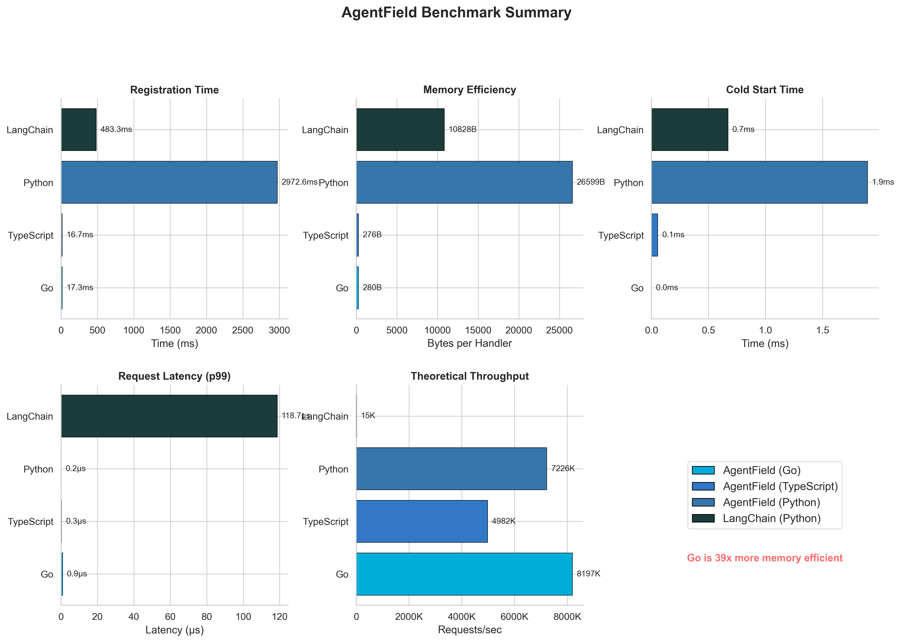
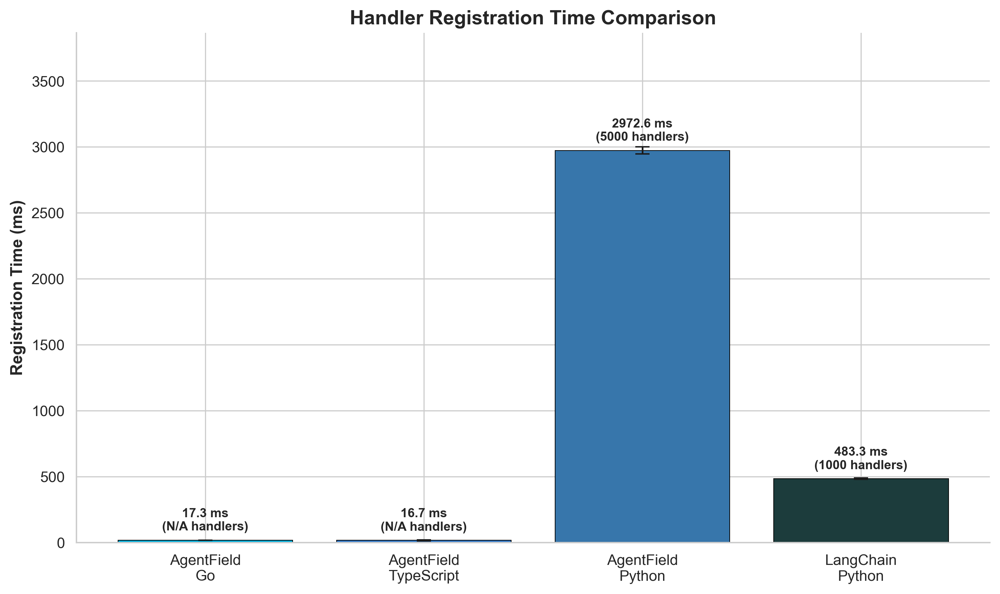
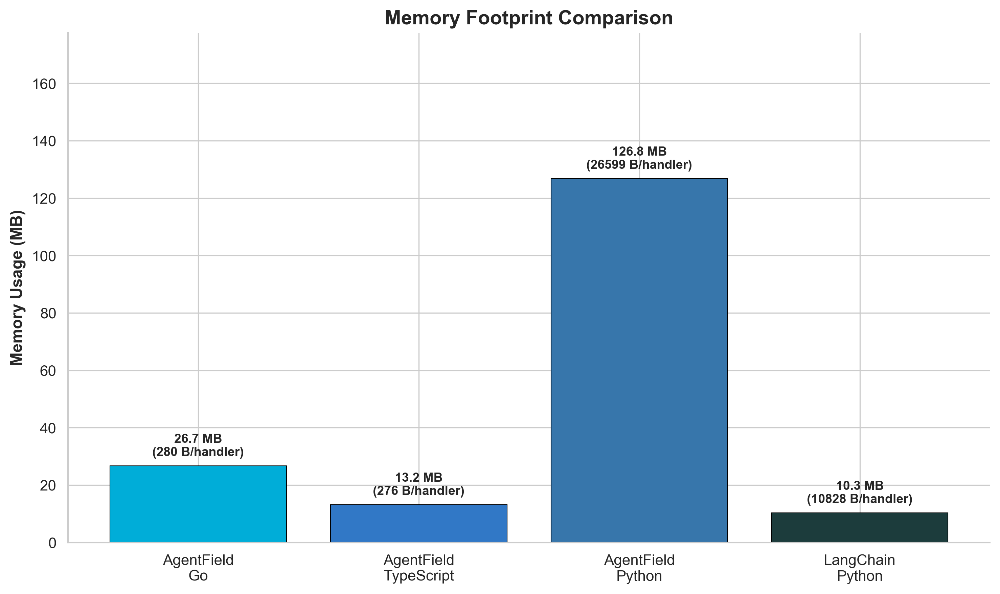
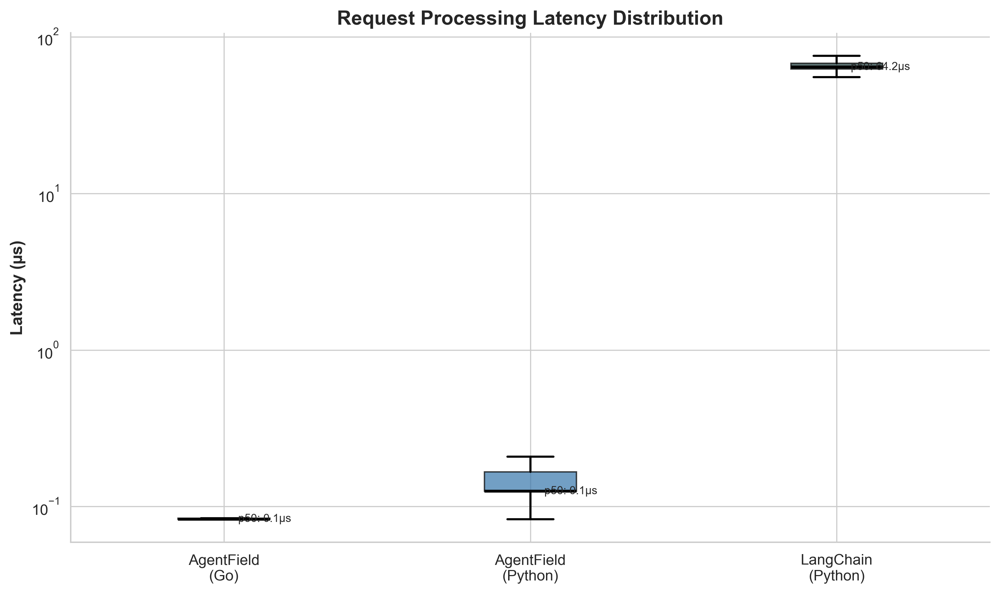

# AgentField Scale Benchmark

A rigorous, reproducible benchmark comparing agent framework performance at scale.

## Methodology

### What We Measure

| Metric | Description | Why It Matters |
|--------|-------------|----------------|
| **Handler Registration Time** | Time to register N handlers/tools | Startup latency for large agent systems |
| **Memory Footprint** | Heap allocation after registration | Infrastructure cost, deployment constraints |
| **Cold Start Time** | Process start → first request served | Serverless/autoscaling responsiveness |
| **Request Latency (p50/p95/p99)** | End-to-end request processing time | User-facing performance |
| **Throughput (RPS)** | Max sustainable requests/second | Capacity planning |
| **Memory Stability** | Memory growth over sustained load | Production reliability |

### Statistical Rigor

- **Multiple runs**: Each test runs 10+ iterations
- **Warm-up**: First 2 runs discarded to avoid JIT/cache effects
- **Percentiles**: Report p50, p95, p99 (not just mean)
- **Standard deviation**: Error bars on all measurements
- **Cold measurements**: Separate process per cold-start test

### Frameworks Tested

| Framework | Language | Version | Notes |
|-----------|----------|---------|-------|
| AgentField Go SDK | Go 1.21+ | latest | Native Go implementation |
| AgentField TypeScript SDK | Node.js 20+ | latest | Native TS implementation |
| AgentField Python SDK | Python 3.12+ | latest | FastAPI-based, memory-optimized |
| LangChain | Python 3.12+ | 0.1.x | Industry standard baseline |

### Workload Definition

**"Agent"**: A handler that can process requests with:
- Input validation (JSON schema)
- Simple computation (no I/O, no LLM calls)
- Structured output

This isolates framework overhead from external dependencies.

## Running the Benchmarks

```bash
# Full benchmark suite
./run_benchmarks.sh

# Individual benchmarks
cd go-bench && go run .
cd python-bench && python benchmark.py
cd langchain-bench && python benchmark.py
```

## Results

### Summary (Latest Run)

| Framework | Handlers | Registration | Memory | Memory/Handler | Latency p99 | Throughput |
|-----------|----------|--------------|--------|----------------|-------------|------------|
| **AgentField Go** | 100,000 | 17.3 ms | 26.7 MB | 280 B | 1.0 µs | 8.2M req/s |
| **AgentField TS** | 50,000 | 16.7 ms | 13.2 MB | 276 B | 0.3 µs | 5.0M req/s |
| **AgentField Python** | 5,000 | 2,973 ms | 127 MB | 26.7 KB | 0.2 µs | 7.0M req/s |
| **LangChain Python** | 1,000 | 483 ms | 10.3 MB | 10.8 KB | 118.7 µs | 15.6K req/s |

### Key Findings

**Registration Speed (normalized to 100K handlers)**
- Go: 17.3 ms
- TypeScript: ~33.4 ms (extrapolated from 50K)
- Python (AgentField): ~59,460 ms (extrapolated from 5K)
- LangChain: ~48,300 ms (extrapolated from 1K)

**Memory Efficiency**
- Go: **280 bytes/handler** (most efficient)
- TypeScript: **276 bytes/handler**
- AgentField Python: 26.7 KB/handler
- LangChain: 10.8 KB/handler

**Throughput**
- Go: **8.2M req/s** (single-threaded theoretical)
- TypeScript: **5.0M req/s**
- LangChain: 15.6K req/s (**~520x slower than Go**)

### Visualizations






See `results/` directory for all raw data and additional visualizations.

## Reproducing

```bash
# Prerequisites
go version  # >= 1.21
python3 --version  # >= 3.11

# Setup
cd examples/benchmarks/100k-scale
python3 -m venv venv
source venv/bin/activate
pip install -r requirements.txt

# Run
./run_benchmarks.sh
```

## Potential Criticisms & Responses

### "Registering handlers isn't real work"
We measure actual request processing throughput and latency, not just registration.

### "What about LLM call overhead?"
LLM latency dominates (100ms-10s). Framework overhead (0.1-10ms) is negligible for LLM workloads but critical for:
- Agent orchestration (routing between agents)
- Tool execution (non-LLM tools)
- High-frequency agent systems

### "Is the comparison fair?"
All frameworks perform identical work: receive JSON, validate, compute, return JSON. No framework-specific optimizations.

### "What about memory leaks?"
We run sustained load tests and measure memory growth over time.
