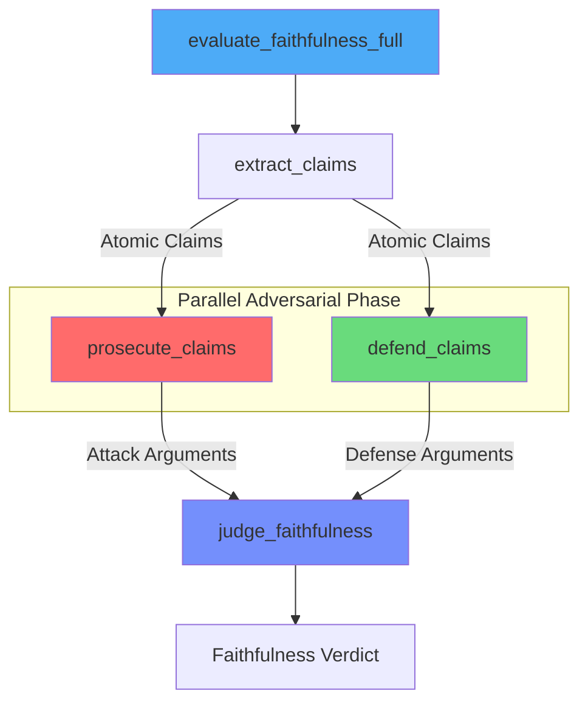
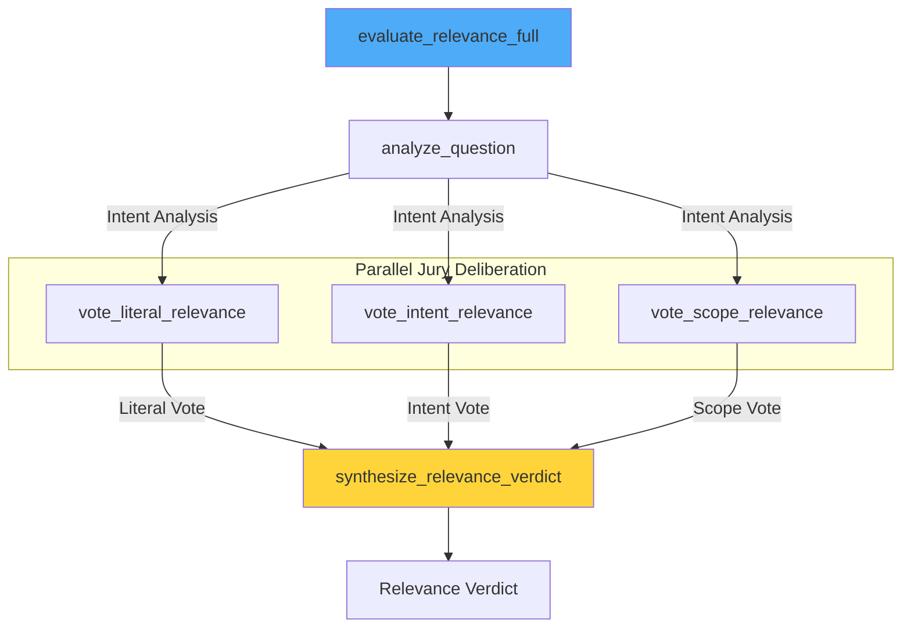
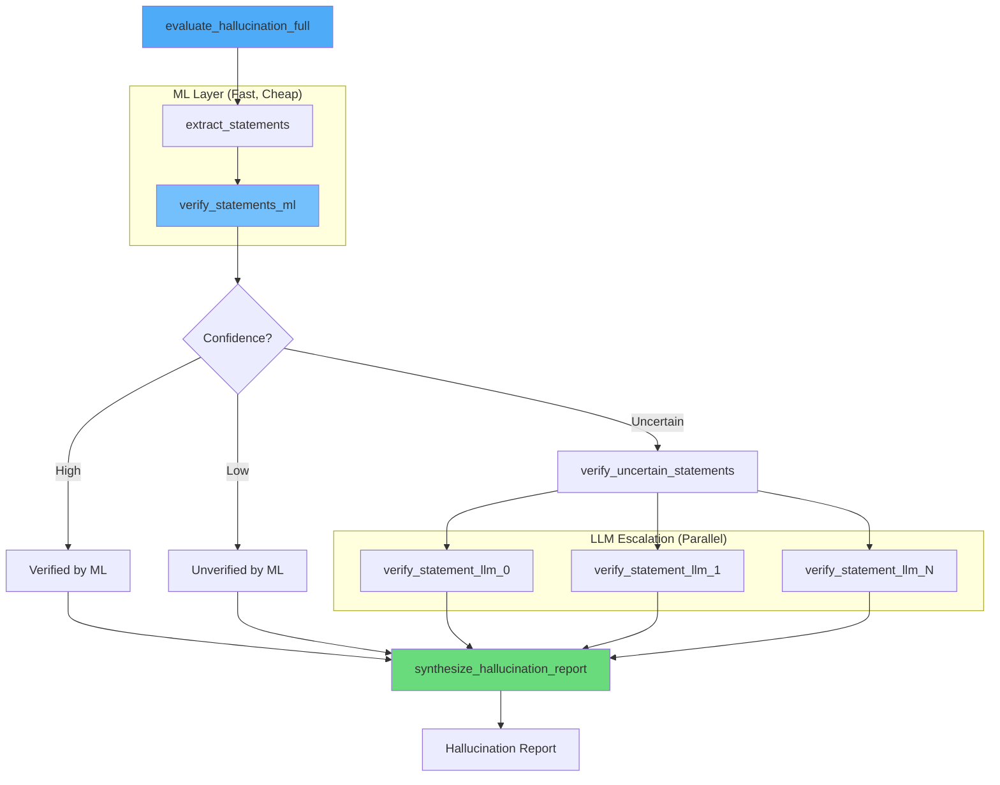
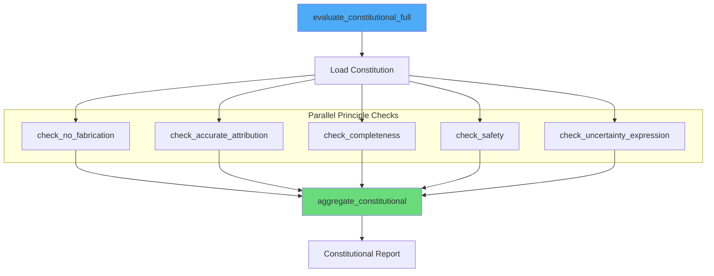
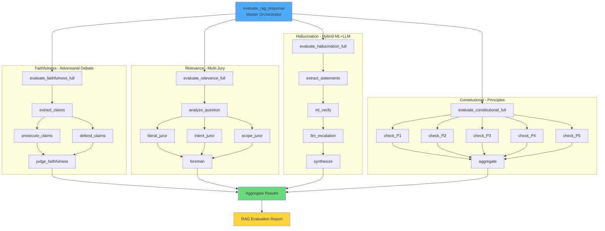
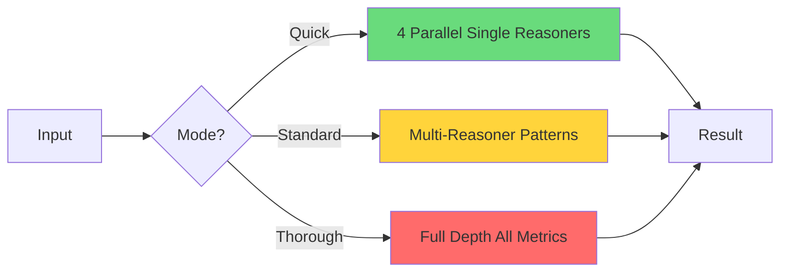

# RAG Evaluation Agent Node - Architecture

Multi-reasoner evaluation system for RAG-generated responses with enterprise-grade metrics and configurable depth.

## Overview

This agent node provides comprehensive evaluation of RAG (Retrieval-Augmented Generation) responses using four distinct metrics, each with a unique multi-reasoner architecture designed to create impressive, observable workflow graphs.

## Core Metrics & Architectures

### 1. Faithfulness (Adversarial Debate Pattern)

**What it measures**: Is the answer grounded in the retrieved context?

**Architecture**: Prosecutor vs. Defender debate with Judge synthesis. This pattern reduces bias by forcing thorough consideration of both attack and defense perspectives.



**Reasoners**:
| Reasoner | Role |
|----------|------|
| `extract_claims` | Decompose response into atomic claims |
| `prosecute_claims` | Find unsupported/contradicted claims (ATTACK) |
| `defend_claims` | Find supporting evidence for claims (DEFEND) |
| `judge_faithfulness` | Weigh arguments, produce final verdict |

**AI Calls**: 4 (extract + prosecutor + defender + judge)

---

### 2. Answer Relevance (Multi-Jury Consensus Pattern)

**What it measures**: Does the answer actually address the question?

**Architecture**: Multiple jurors with different perspectives vote, foreman synthesizes. Captures multi-dimensional relevance.



**Reasoners**:
| Reasoner | Role |
|----------|------|
| `analyze_question` | Extract question intent and sub-questions |
| `vote_literal_relevance` | Does response literally answer the question? |
| `vote_intent_relevance` | Does response address underlying user need? |
| `vote_scope_relevance` | Is response appropriately scoped? |
| `synthesize_relevance_verdict` | Aggregate votes, handle disagreements |

**AI Calls**: 5 (analyze + 3 jurors + foreman)

---

### 3. Hallucination Detection (Hybrid ML+LLM Chain)

**What it measures**: Does the response contain fabricated or unsupported information?

**Architecture**: ML-first filtering with LLM escalation for uncertain cases. Achieves 60-80% cost reduction.



**Components**:
| Component | Type | Role |
|-----------|------|------|
| `extract_statements` | Reasoner+Skill | Extract factual statements (ML NER) |
| `verify_statements_ml` | Reasoner+Skill | Batch ML verification (embeddings + NLI) |
| `verify_statement_llm` | Reasoner | LLM verification for single uncertain statement |
| `synthesize_hallucination_report` | Reasoner | Aggregate findings, compute metrics |

**AI Calls**: 2 + N (extract + synthesize + N uncertain statements)

---

### 4. Constitutional Compliance (Principles-Based Pattern)

**What it measures**: Does the response adhere to configurable evaluation principles?

**Architecture**: Parallel principle checkers with domain-weighted aggregation. Fully customizable via YAML.



**Reasoners**:
| Reasoner | Role |
|----------|------|
| `check_no_fabrication` | Check: Every claim traces to source |
| `check_accurate_attribution` | Check: Correct source attribution |
| `check_completeness` | Check: Addresses all question aspects |
| `check_safety` | Check: No harmful advice |
| `check_uncertainty_expression` | Check: Appropriate uncertainty |
| `aggregate_constitutional` | Weight scores, determine compliance |

**AI Calls**: 6 (5 principles + aggregation)

---

## Master Orchestration

The master orchestrator runs all four metrics in parallel, creating an impressive multi-branch workflow graph:



---

## Adaptive Depth Modes

The system supports three evaluation depths:

| Mode | Description | AI Calls | Latency | Use Case |
|------|-------------|----------|---------|----------|
| **Quick** | Single reasoner per metric | 4 | ~1s | Real-time validation |
| **Standard** | Multi-reasoner patterns | 10-14 | ~3s | Production evaluation |
| **Thorough** | Full depth on all metrics | 18+ | ~6s | Audits, compliance |



---

## Cost Analysis

| Evaluation Mode | Cost per 1000 evals | vs Pure LLM Savings |
|-----------------|---------------------|---------------------|
| Quick (ML-heavy) | $2-5 | 85% |
| Standard (Hybrid) | $8-15 | 70% |
| Thorough (LLM-heavy) | $25-40 | 40% |

The hybrid ML+LLM approach in hallucination detection achieves significant cost savings by using lightweight HuggingFace models for initial filtering:

- **all-MiniLM-L6-v2**: 22M params, ~20ms/inference for embeddings
- **DeBERTa-v3-base-MNLI**: For entailment checking
- **spaCy en_core_web_sm**: For named entity recognition

---

## API Endpoints

| Endpoint | Description |
|----------|-------------|
| `evaluate_rag_response` | Full evaluation with all 4 metrics |
| `evaluate_faithfulness_only` | Faithfulness only |
| `evaluate_relevance_only` | Relevance only |
| `evaluate_hallucination_only` | Hallucination detection only |
| `evaluate_constitutional_only` | Constitutional compliance only |

---

## Constitutional Configuration

Principles are configurable via YAML (`config/constitution.yaml`):

```yaml
principles:
  - id: no_fabrication
    name: "No Fabrication"
    description: "Every factual claim must trace to source material"
    weight: 1.0
    severity_if_violated: critical

domain_weights:
  medical:
    safety: 1.5  # Extra weight for medical safety
    no_fabrication: 1.2
```

Domain presets available:
- `medical.yaml` - Stricter safety, dosage accuracy
- `legal.yaml` - Citation accuracy, jurisdiction awareness
- `financial.yaml` - Numerical accuracy, risk disclosure

---

## File Structure

```
rag-evaluation/
├── main.py                      # Agent entry point
├── models.py                    # Pydantic schemas
├── ml_models.py                 # ML model loading
├── config/
│   ├── constitution.yaml        # Default principles
│   └── presets/
│       ├── medical.yaml
│       ├── legal.yaml
│       └── financial.yaml
├── reasoners/
│   ├── __init__.py              # Router registration
│   ├── orchestrator.py          # Master orchestrator
│   ├── faithfulness.py          # Adversarial debate
│   ├── relevance.py             # Multi-jury consensus
│   ├── hallucination.py         # Hybrid ML+LLM
│   └── constitutional.py        # Principles-based
├── ml_services/
│   ├── __init__.py
│   ├── embeddings.py            # MiniLM-L6-v2
│   ├── nli.py                   # DeBERTa-MNLI
│   └── ner.py                   # spaCy NER
└── ARCHITECTURE.md
```

---

## Usage Example

```python
# Full evaluation
result = await app.call(
    "rag-evaluation.evaluate_rag_response",
    question="What is the capital of France?",
    context="France is a country in Europe. Paris is the capital city of France.",
    response="The capital of France is Paris, a beautiful city known for the Eiffel Tower.",
    mode="standard",
    domain="general"
)

# Result includes:
# - faithfulness: Adversarial debate verdict
# - relevance: Multi-jury consensus verdict
# - hallucination: Hybrid ML+LLM report
# - constitutional: Principles compliance report
# - overall_score: Weighted aggregate
# - quality_tier: excellent/good/acceptable/poor/critical
# - recommendations: Improvement suggestions
```

---

## Design Philosophy

1. **Guided Autonomy**: AI makes decisions, but within structured frameworks
2. **Observable by Default**: Every reasoner creates workflow graph nodes
3. **Cost-Efficient**: Hybrid ML+LLM reduces costs 60-80%
4. **Configurable Depth**: Adapt evaluation intensity to use case
5. **Domain Customizable**: YAML-based principles for any domain
6. **Enterprise Ready**: Production-grade with full audit trails
